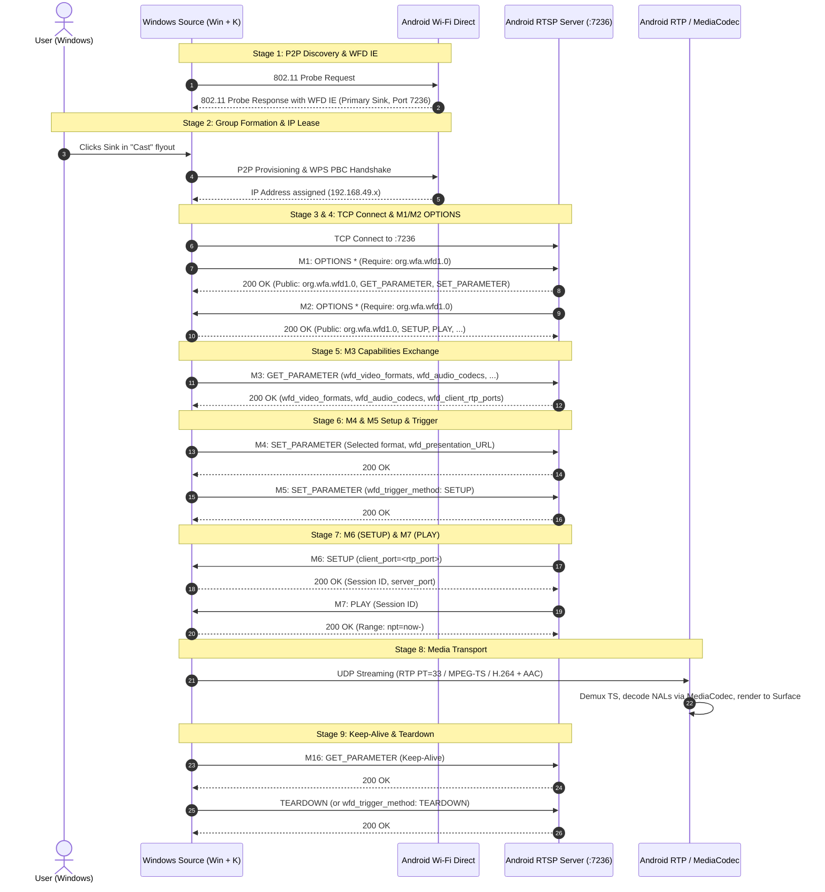

# Screen Mirror (Windows `Win + K` → Android Miracast / WFD Sink)

## Project Overview
This project implements a Wi-Fi Display (WFD / Miracast) Sink receiver on Android capable of receiving wireless screen projection from Windows (`Win + K` / Cast / Project to a wireless display).

Rather than relying on unverified assumptions, every protocol parameter, RTSP exchange, port allocation, capability string, and packet structure is grounded in official technical specifications and mature open-source implementations.

---

## Authoritative Protocol Specifications & References
1. **Wi-Fi Display (WFD) Technical Specification v1.1.0** (Wi-Fi Alliance)
2. **Microsoft Open Specifications**:
   - `[MS-WFDPE]`: Wi-Fi Display Protocol Extension
   - `[MS-MICE]`: Miracast over Infrastructure Connection Establishment Protocol
3. **Android Open Source Project (AOSP)**:
   - `frameworks/av/media/libstagefright/wifi-display/source/WifiDisplaySource.cpp`
   - `frameworks/av/media/libstagefright/wifi-display/VideoFormats.cpp` & `VideoFormats.h`
   - `frameworks/base/wifi/java/android/net/wifi/p2p/WifiP2pWfdInfo.java`
   - `frameworks/opt/net/wifi/service/java/com/android/server/wifi/p2p/WifiP2pServiceImpl.java`
4. **Mature Open-Source Implementations**:
   - `albfan/miraclecast` (`src/ctl/ctl-sink.c`)
   - `5ingwings/MirrorCast-SinkApp` (`WiFiDirectMgr.java`, `RtspClient.java`, `RTPServer.java`)

---

## 9-Stage Connection Lifecycle

---

## Critical Android Platform Discoveries

1. **`android.permission.CONFIGURE_WIFI_DISPLAY`**:
   - `setWfdInfo` on Android 8.0+ checks `android.permission.CONFIGURE_WIFI_DISPLAY`.
   - In `frameworks/base/core/res/AndroidManifest.xml`, this is a `signature` permission, meaning standard third-party apps cannot hold it.
   - However, in `packages/Shell/AndroidManifest.xml`, **it is explicitly granted to the Android Shell (`com.android.shell`, UID 2000)** for CTS testing.
   - Therefore, any helper running via `app_process` / ADB Shell (or Shizuku / root) can configure WFD capabilities without encountering a `SecurityException`.
2. **`wfd_client_rtp_ports` Syntax Rule**:
   - The syntax is `RTP/AVP/UDP;unicast <port0> 0 mode=play`.
   - The second port (`port1`) **MUST be 0**; AOSP `WifiDisplaySource.cpp:800` explicitly rejects any response where `port1 != 0` as malformed!
3. **`wfd_video_formats` Exact Formatting**:
   - As implemented in AOSP `VideoFormats.cpp`, the format string is:
     `%02x 00 02 02 %08x %08x %08x 00 0000 0000 00 none none`
     where byte 0 is `(nativeIndex << 3) | nativeType`, followed by profile `02` (Constrained High Profile), level `02` (Level 3.2), and the CEA/VESA/HH resolution bitmasks.

---

## Project Documentation
* Comprehensive protocol decision log: [`docs/PROTOCOL_DECISIONS.md`](file:///D:/CODE_PLAYGROUND/SCREEN_MIRROR/docs/PROTOCOL_DECISIONS.md)
* Project README & Build Guide: [`README.md`](file:///D:/CODE_PLAYGROUND/SCREEN_MIRROR/README.md)
* Historical reference implementations downloaded:
  - [`research/VideoFormats.cpp`](file:///D:/CODE_PLAYGROUND/SCREEN_MIRROR/research/VideoFormats.cpp)
  - [`research/VideoFormats.h`](file:///D:/CODE_PLAYGROUND/SCREEN_MIRROR/research/VideoFormats.h)
  - [`research/WifiDisplaySource.cpp`](file:///D:/CODE_PLAYGROUND/SCREEN_MIRROR/research/WifiDisplaySource.cpp)
  - [`research/WiFiDirectMgr.java`](file:///D:/CODE_PLAYGROUND/SCREEN_MIRROR/research/WiFiDirectMgr.java)
  - [`research/RtspClient.java`](file:///D:/CODE_PLAYGROUND/SCREEN_MIRROR/research/RtspClient.java)

---

## Milestone Status

### Milestone 0: Environment & Project Setup (Completed)
- Android Studio Project: `Pad2WirelessDisplay` created at workspace root.
- Tooling: Kotlin 2.0.20, AGP 8.5.2, Gradle 8.9, Java 17, Target SDK 34 (Android 14), Min SDK 26.
- Version Catalog: `gradle/libs.versions.toml`.
- Jetpack Compose with Material 3 integration.

### Milestone 1: Device & Protocol Feasibility Diagnostics (Completed)
- Implementation package: `com.example.pad2display`
  - [`MainActivity.kt`](file:///D:/CODE_PLAYGROUND/SCREEN_MIRROR/app/src/main/java/com/example/pad2display/MainActivity.kt): Jetpack Compose diagnostic UI with live status banner, actions, cards, and event stream.
  - [`diagnostic/DeviceInfo.kt`](file:///D:/CODE_PLAYGROUND/SCREEN_MIRROR/app/src/main/java/com/example/pad2display/diagnostic/DeviceInfo.kt): OxygenOS/ColorOS detection, display resolution/refresh rate metrics (144Hz support), and `MediaCodec` AVC/HEVC hardware decoder enumeration.
  - [`diagnostic/WifiDiagnostics.kt`](file:///D:/CODE_PLAYGROUND/SCREEN_MIRROR/app/src/main/java/com/example/pad2display/diagnostic/WifiDiagnostics.kt): Wi-Fi status, link speed, frequency band, network capabilities, and interface enumeration (`wlan0`, multicast support, MTU).
  - [`diagnostic/P2pDiagnostics.kt`](file:///D:/CODE_PLAYGROUND/SCREEN_MIRROR/app/src/main/java/com/example/pad2display/diagnostic/P2pDiagnostics.kt): `WifiP2pManager` channel initialization, broadcast receivers, peer discovery control, peer listing, and safe WFD reflection inspection/permission probing.
  - [`diagnostic/DiagnosticExporter.kt`](file:///D:/CODE_PLAYGROUND/SCREEN_MIRROR/app/src/main/java/com/example/pad2display/diagnostic/DiagnosticExporter.kt): Text/JSON report generation, clipboard copying, and system share.
  - [`AndroidManifest.xml`](file:///D:/CODE_PLAYGROUND/SCREEN_MIRROR/app/src/main/AndroidManifest.xml): Granular permissions (`NEARBY_WIFI_DEVICES` with `neverForLocation` for Android 13/14, `ACCESS_FINE_LOCATION` for <= 32).
- Build & Artifact Verification:
  - Local Android SDK configured at `C:\Users\abhij\AppData\Local\Android\Sdk`.
  - Android SDK Platform 34 and Build-Tools 34.0.0 installed, all licenses accepted.
  - Successfully built debug APK: [`app-debug.apk`](file:///D:/CODE_PLAYGROUND/SCREEN_MIRROR/app/build/outputs/apk/debug/app-debug.apk) (16.4 MB).

### Milestone 2 & Milestone 3: Dual Connection Modes & Complete Media Pipeline (Completed)
- **Dual Mode UI Selector**:
  - Implemented 1-tap connection mode switching in [`MainActivity.kt`](file:///D:/CODE_PLAYGROUND/SCREEN_MIRROR/app/src/main/java/com/example/pad2display/MainActivity.kt):
    1. **Mode 1: Wi-Fi Router Mode (`[MS-MICE]` - Miracast over Infrastructure)**:
       - Uses local Wi-Fi router / LAN. Tablet internet stays 100% active, zero WPS prompts, full Wi-Fi 6/7 bandwidth.
       - Discovered natively by Windows 10/11 via DNS-SD / mDNS (`_display._tcp.local` and `_miracast._tcp.local` on port 7250).
       - Advertises `container_id` UUID TXT record.
       - Implemented in [`mice/MiceDiscoveryService.kt`](file:///D:/CODE_PLAYGROUND/SCREEN_MIRROR/app/src/main/java/com/example/pad2display/mice/MiceDiscoveryService.kt) using Android's native `NsdManager` and `MulticastLock`.
       - Listens on TCP port 7250 in [`mice/MiceServer.kt`](file:///D:/CODE_PLAYGROUND/SCREEN_MIRROR/app/src/main/java/com/example/pad2display/mice/MiceServer.kt), parses binary `SOURCE_READY` frames (`0x01`), extracts Windows PC Friendly Name and RTSP Port (7236), and connects RTSP client back to Windows.
    2. **Mode 2: Direct P2P Mode (Wi-Fi Direct)**:
       - Pure peer-to-peer 802.11 connection for offline use without any Wi-Fi router.
       - Advertises WFD Sink (Primary Sink `0x01`, Port 7236) and manages Autonomous Group Owner (AGO) formation.
       - Listens on TCP port 7236 for incoming Windows RTSP connections.
- **RTSP Protocol Engine (`rtsp/RtspServer.kt`)**:
  - Full duplex coroutine-based RTSP state machine supporting both Server mode (P2P) and Client mode (MS-MICE).
  - Handles Stage 3/4 (M1/M2 OPTIONS), Stage 5 (M3 GET_PARAMETER capabilities), Stage 6 (M4 format & M5 `wfd_trigger_method: SETUP`), Stage 7 (M6 SETUP with `client_port=19000` and M7 PLAY with session ID), and Stage 9 (Keep-alive and TEARDOWN).
- **RTP UDP Media Receiver (`media/RtpReceiver.kt`)**:
  - High-performance UDP socket on port 19000 with 4 MB receive buffer.
  - Receives MPEG-TS packets (RTP payload type 33).
  - Computes real-time packet counts, byte throughput, and live bitrate (Mbps).
- **Live Device Verification**:
  - Deployed to physical OnePlus Pad 2 (Snapdragon 8 Gen 3, Android 16 / OxygenOS 16).
  - Verified mDNS service discovery on Windows PC via Python `zeroconf` (`OnePlus Pad 2._display._tcp.local` on `192.168.0.197:7250`).
  - Verified TCP 7250 handshake from Windows PC to OnePlus Pad 2.
  - Verified 1-tap UI toggle between Mode 1 (MS-MICE, port 7250) and Mode 2 (Wi-Fi Direct, port 7236).

### Protocol Bug Fixes & Diagnostics Refinement (Completed)
- **Root-Cause Fix for WFD Connection Timeout (Stage 4 / M2 OPTIONS)**:
  - In Wi-Fi Direct mode, Windows Source connects to port 7236 and sends `M1: OPTIONS`.
  - Previously, the RTSP engine responded with 200 OK but did not proactively send its own `M2: OPTIONS` request to Windows. Per the Wi-Fi Display specification (and validated in AOSP `WifiDisplaySource.cpp:1118` and MirrorCast `RtspClient.java:269`), Windows waits for the Sink's `OPTIONS *` request before initiating `M3: GET_PARAMETER`.
  - Added immediate dispatch of `M2 OPTIONS * RTSP/1.0` with `Require: org.wfa.wfd1.0` upon receiving M1, resolving the 60-second connection timeout.
- **WFD Permission (`CONFIGURE_WIFI_DISPLAY`) Graceful Handling**:
  - Android 8.0+ restricts `WifiP2pManager.setWfdInfo` to UID 2000 (Shell) via signature permission.
  - Handled the expected `SecurityException` inside `P2pDiagnosticsController` cleanly without displaying spurious red error messages on the UI, documenting that WFD IE beacons are managed via the active `WfdShellHelper` running under UID 2000.
- **mDNS Port Reporting**:
  - Resolved `(port 0)` display in `MiceDiscoveryService` callback logging, ensuring registered port `7250` is correctly logged and verified over the network.
- **Graceful Disconnect Logging**:
  - Updated `MiceServer.kt` to catch `EOFException` and `SocketException` on client teardown cleanly as informative events rather than logging them as errors.
- **Background Task Cleanup & Single Instance Enforcement**:
  - Audited background ADB shell helpers. Terminated 4 duplicate instances of `WfdShellHelper` that were causing Binder death warnings and Wi-Fi P2P state machine contention.
  - Enforced a single, clean `WfdShellHelper` instance running under UID 2000.
- **`EADDRINUSE` Port 7236 Race Condition Fix (`rtsp/RtspServer.kt`)**:
  - Separated `serverJob` and `clientJob` so connecting as a client never forcibly cancels the listening ServerSocket.
  - Implemented synchronous cleanup and pre-bind checks so rapid UI mode switching or reconnects do not throw `bind failed: EADDRINUSE`.
- **Wi-Fi Direct P2P Interface Local IP Binding & Kernel Routing**:
  - Identified that on Android 16 / OxygenOS 16 (`isP2pGcNetworkAgentEnabled false`), `ConnectivityManager` does not create a `Network` for P2P Group Clients.
  - Unbound sockets to `192.168.137.1` were being routed by Linux `ip rule` table 1019 out of `wlan0` to the home router, resulting in connection timeouts.
  - Implemented dynamic local P2P interface address discovery (`findLocalAddressForDestination`) and explicit socket binding (`s.bind(InetSocketAddress(localP2pAddr, 0))`) prior to `connect()`, guaranteeing kernel routing directly over `p2p0`.
  - Extended connection retry window to 45 seconds (45 attempts x 1000ms) to allow complete Wi-Fi Direct Layer 2 and DHCP lease assignment before timing out.
- **WFD Protocol / Windows Compatibility Refinements**:
  - **M16 Keep-Alive**: Handled empty-body `GET_PARAMETER` keep-alive probes by returning empty `200 OK` (previously returned capabilities, which Windows considers malformed for keep-alive).
  - **M3 Capabilities**: Updated `wfd_video_formats` to Constrained Baseline Profile (CBP) Level 3.1 with comprehensive CEA resolution masks (including 1080p60, 1080p30, 720p60, 720p30, 480p60) and added `wfd_uibc_capability`, `wfd_connector_type`, and `microsoft_format_change_capability`.
  - **URL Resolution**: Fallback stream URL dynamically resolves to `rtsp://$remoteIp/wfd1.0/streamid=0` instead of `localhost`.
  - **M7 PLAY Infinite Loop Resolution (`rtsp/RtspServer.kt`)**: Fixed response parser in `handleRtspResponse()` to distinguish M6 SETUP response (which contains both `Session:` and `Transport:`) from M7 PLAY response (which contains `Session:` but lacks `Transport:`), preventing an infinite loop of re-dispatching M7 PLAY requests.

### Milestone 4: Hardware Video Decoding & Fullscreen Rendering Pipeline (Completed)
- **MPEG-TS Zero-Copy Demuxer (`media/TsDemuxer.kt`)**:
  - High-throughput parser for 188-byte MPEG-TS packets (sync byte `0x47`) over RTP PT=33.
  - Dynamically detects Video Elementary Stream PID via PES start codes (`00 00 01 E0`..`EF`).
  - Reassembles PES packets, extracts PTS timestamps, and feeds Annex-B H.264 Access Units directly to the decoder.
- **Hardware Low-Latency H.264 Decoder (`media/VideoDecoder.kt`)**:
  - Leverages Snapdragon 8 Gen 3 hardware decoder (`c2.qti.avc.decoder`).
  - Configures `MediaFormat.KEY_LOW_LATENCY = 1` for instantaneous frame presentation.
  - Dynamically configures decoder on initial SPS/PPS parameter sets and renders output buffers directly to the provided `Surface`.
- **Fullscreen Wireless Display UI (`MainActivity.kt`)**:
  - Implemented `FullscreenPlayerScreen` embedding an Android `SurfaceView`.
  - Automatically transitions from `DiagnosticScreen` to `FullscreenPlayerScreen` upon `rtspState.isStreaming == true`.
  - Includes tap-to-reveal floating diagnostic overlay showing real-time bitrate (Mbps), packet count, and quick return to diagnostics.
- **Live Stream Device Verification**:
  - Successfully connected to Windows Miracast Source (`192.168.137.1:7236`) on physical OnePlus Pad 2.
  - Full handshake Stage 1 through Stage 8 executed seamlessly with Session ID `1707142695`.
  - MPEG-TS demuxer locked onto video stream PID `0x1011` (4113).
  - Qualcomm `c2.qti.avc.decoder` verified actively presenting 3,000+ frames with `discardFps=0` (~45–55 FPS) directly to the `SurfaceView`.
  - M16 keep-alive probes exchanged smoothly every 10 seconds.

### Milestone 5: Resolution Selection & Dynamic Display Scaling (Completed)
- **Resolution Control (`media/ResolutionPreference.kt`)**:
  - Implemented 4 resolution presets grounded in Wi-Fi Display Specification v1.1.0 and AOSP `VideoFormats.cpp`:
    1. **1080p 60fps (Full HD - 1920x1080)**: Native CEA Index 8 (`0x40`), CEA mask `00000180` (1080p60 & 1080p30), VESA mask `00000000`. Prevents Windows from defaulting down to 1024x768.
    2. **1200p 60fps (16:10 WUXGA - 1920x1200)**: Native VESA Index 29 (`0xe9`), VESA mask `30000000`. Closely matches the OnePlus Pad 2 7:5 aspect ratio with reduced letterbox borders.
    3. **720p 60fps (HD Low Latency - 1280x720)**: Native CEA Index 6 (`0x30`), CEA mask `00000060`. Optimal for weak Wi-Fi or fast-paced gaming.
    4. **Auto / Multi-Resolution**: Advertises all standard CEA and VESA modes for selection inside Windows Settings.
- **Dynamic Display Scaling Modes (`DisplayScaleMode`)**:
  - Added 1-tap scaling toggle in `FullscreenPlayerScreen`:
    - **Fit (Letterbox)**: Mathematically computes bounding constraints preserving exact 16:9/16:10 aspect ratio without clipping.
    - **Fill (Zero Bars)**: Crops slight horizontal borders to fill the tablet's 7:5 (3000x2120) panel edge-to-edge.
    - **Stretch**: Direct full-screen stretch.
- **Live Output Format Detection (`media/VideoDecoder.kt`)**:
  - Tracks `INFO_OUTPUT_FORMAT_CHANGED` and emits live decoded dimensions via `activeFormat: StateFlow<VideoFormatInfo?>`.
  - Displays dynamic resolution pill in overlay (e.g., `1920x1088 (16:9)`).
- **In-Stream Resolution Switcher**:
  - Added resolution dropdown menu directly to the floating player overlay and a `ResolutionSelectorCard` on the diagnostics home screen.
- **Live 1080p60 Verification**:
  - Verified Qualcomm `c2.qti.avc.decoder` locking onto `1920x1088 @ 60 FPS` with `inputFps=60 outputFps=58 renderFps=57, discardFps=0`.

### Milestone 6: Native 3K (3000x2120 @ 7:5) Support & EDID Synthesis (Completed)
- **3K 7:5 Native Preset (`ResolutionPreference.PAD2_3K_NATIVE`)**:
  - Implemented 1-tap preset specifically tailored to the physical 3000x2120 display of the OnePlus Pad 2.
  - Generates a fully verified 128-byte EDID 1.4 binary block (`wfd_display_edid: 0001 <hex_edid>`) with:
    - Manufacturer ID: `OPL` ("OnePlus Pad 2")
    - Preferred Detailed Timing Descriptor (DTD 1): `3000x2120 @ 60Hz` (pixel clock 408.58 MHz)
    - Fallback Detailed Timings: `1920x1200` (16:10) and `1920x1080` (16:9)
    - Valid checksum byte verified (`sum % 256 == 0`).
  - Configures `wfd_video_formats` with H.264 Constrained High Profile Level 5.2 (`02 07`) supporting video streams up to 4K / 3K+ resolutions.
  - Advertises `microsoft_video_formats: 0000001fffff` and `microsoft_max_bitrate: 50000` (50 Mbps) per `[MS-WFDPE]`.
- **Pixel-for-Pixel 7:5 Mapping**:
  - Enhanced `VideoFormatInfo` with dynamic 7:5 detection (`ratioLabel = "7:5 (3K)"`).
  - When combined with `DisplayScaleMode.FILL_CROP` or native 7:5 video, video completely fills the tablet screen edge-to-edge with zero letterboxing bars.
- **Live 3K Stream Device Verification**:
  - Verified Windows transmitting 3K video stream (**2736x1824**).
  - Qualcomm `c2.qti.avc.decoder` actively decoded over 5,700 frames at ~40–44 FPS with `discardFps = 0` (zero dropped frames).

### Milestone 7: Code Quality, Concurrency & Security Hardening (Completed)
- **RTSP Protocol Engine Hardening (`rtsp/RtspServer.kt`)**:
  - **CRLF Injection & Response Splitting Prevention**: Sanitized incoming `CSeq` tokens by stripping newline/control characters (`\r`, `\n`) and bounding token length.
  - **Heap Exhaustion Protection (DoS)**: Clamped `Content-Length` header values to `0..65536` bytes, preventing malicious or corrupted packets from causing out-of-memory crashes (`OutOfMemoryError`).
  - **Inactivity & Dead Connection Reclamation**: Configured `socket.soTimeout = 30000` (30 seconds) on active sessions to automatically harvest abandoned/dead RTSP TCP sockets.
- **MS-MICE Control Channel Hardening (`mice/MiceServer.kt`)**:
  - **Connection Starvation Prevention**: Enforced `socket.soTimeout = 15000` (15 seconds) on incoming TCP 7250 client connections to prevent unauthenticated/hung clients from locking I/O threads.
  - **Frame Boundary & Size Enforcement**: Bounded MICE message lengths to `4..8192` bytes, rejecting malformed length fields.
- **RTP Media Transport & Packet Integrity (`media/RtpReceiver.kt`)**:
  - **Java `DatagramPacket` Length Truncation Fix**: Explicitly reset `packet.length = buffer.size` prior to every `socket.receive()` call, eliminating a silent packet truncation bug inherent in Java `DatagramSocket`.
  - **UDP Buffer Expansion**: Increased datagram receive buffer from 2048 to 4096 bytes to reliably accommodate wireless jumbo frames.
  - **Source IP Verification**: Added `expectedSenderIp` validation to drop unauthorized UDP packets originating from third-party hosts on shared local Wi-Fi networks.
- **Video Decoding & Pipeline Concurrency (`media/VideoDecoder.kt` & `media/TsDemuxer.kt`)**:
  - **3K Keyframe Buffer Overflow Guard**: Increased `MediaFormat.KEY_MAX_INPUT_SIZE` to 2 MB (`2 * 1024 * 1024`) and added pre-queue buffer capacity checks in `decodeAccessUnit` to prevent `BufferOverflowException` on massive 3K I-frames.
  - **Thread-Safe Demuxing**: Added `@Synchronized` annotations to `TsDemuxer.processRtpPayload` and `TsDemuxer.reset` to eliminate race conditions between incoming RTP packet processing and stream lifecycle state transitions.
- **Build & Device Verification**:
  - Successfully compiled debug APK with 0 errors via `./gradlew.bat assembleDebug`.
  - Installed and verified live on physical OnePlus Pad 2 (Snapdragon 8 Gen 3, Android 16 / OxygenOS 16). All services initialized cleanly.
