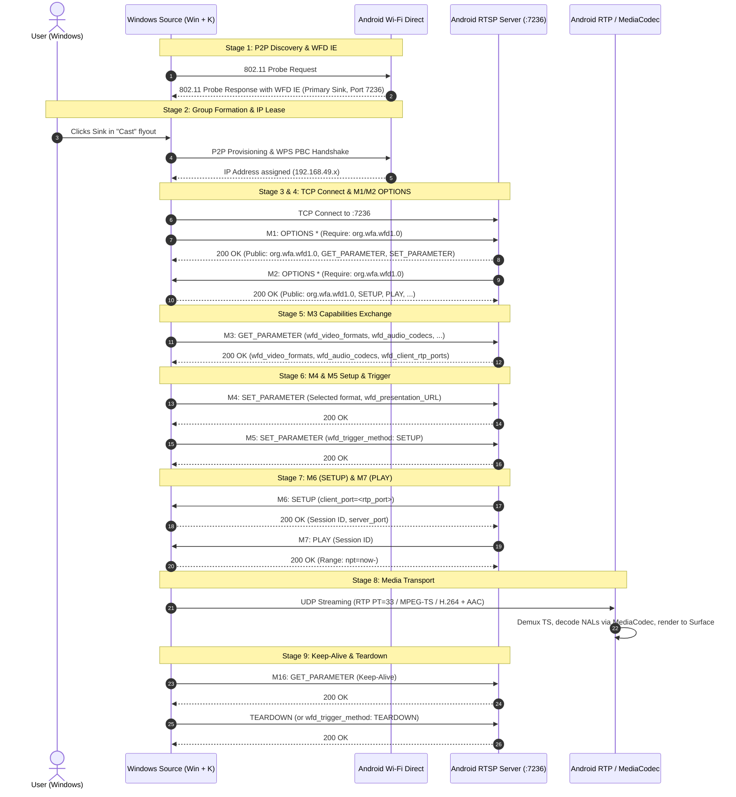

# Screen Mirror (Windows `Win + K` → Android Miracast / WFD Sink)

## Project Overview
This project implements a Wi-Fi Display (WFD / Miracast) Sink receiver on Android capable of receiving wireless screen projection from Windows (`Win + K` / Cast / Project to a wireless display).

Rather than relying on unverified assumptions, every protocol parameter, RTSP exchange, port allocation, capability string, and packet structure is grounded in official technical specifications and mature open-source implementations.

---

## Mandatory Git Branching & Release Workflow
Governed by the 19-section [**Mandatory Git Development & Release Criteria**](.agents/rules/git-workflow.md):
- **`main` Branch**: Reserved strictly for official, fully-tested, signed production releases (e.g. `v1.0.0`, `v1.1.0`). Direct development commits on `main` are strictly prohibited.
- **`dev` Branch**: Active integration and staging branch. Code from feature branches merges here only after all unit tests and builds pass.
- **`feature/*` Branches**: All active feature development, protocol experiments, and bug fixes must be conducted on dedicated feature branches (e.g., `feature/m9-foreground-service-recovery`, `feature/m10-uibc-touch`).
- **Release Cadence**:
  1. Develop and verify on `feature/<name>` (`./gradlew.bat test`, `./gradlew.bat assembleDebug`).
  2. Merge feature branch into `dev`.
  3. Validate release build on `dev` (`./gradlew.bat assembleRelease`).
  4. Merge `dev` into `main`, tag the new release version (`git tag -a vX.Y.Z`), and publish release APK.
- **Golden Rule**: *Feature branches are for development. `dev` is for integration. `main` is for production. No feature is complete until it is implemented, tested, verified, documented, and safely integrated.*

---

## Authoritative Protocol Specifications & References
1. **Wi-Fi Display (WFD) Technical Specification v1.1.0** (Wi-Fi Alliance)
2. **Microsoft Open Specifications**:
   - `[MS-WFDPE]`: Wi-Fi Display Protocol Extension
   - `[MS-MICE]`: Miracast over Infrastructure Connection Establishment Protocol
3. **Android Open Source Project (AOSP)**:
   - `frameworks/av/media/libstagefright/wifi-display/source/WifiDisplaySource.cpp`
   - `frameworks/av/media/libstagefright/wifi-display/VideoFormats.cpp` & `VideoFormats.h`
   - `frameworks/base/wifi/java/android/net/wifi/p2p/WifiP2pWfdInfo.java`
   - `frameworks/opt/net/wifi/service/java/com/android/server/wifi/p2p/WifiP2pServiceImpl.java`
4. **Mature Open-Source Implementations**:
   - `albfan/miraclecast` (`src/ctl/ctl-sink.c`)
   - `5ingwings/MirrorCast-SinkApp` (`WiFiDirectMgr.java`, `RtspClient.java`, `RTPServer.java`)

---

## 9-Stage Connection Lifecycle

---

## Critical Android Platform Discoveries

1. **`android.permission.CONFIGURE_WIFI_DISPLAY`**:
   - `setWfdInfo` on Android 8.0+ checks `android.permission.CONFIGURE_WIFI_DISPLAY`.
   - In `frameworks/base/core/res/AndroidManifest.xml`, this is a `signature` permission, meaning standard third-party apps cannot hold it.
   - However, in `packages/Shell/AndroidManifest.xml`, **it is explicitly granted to the Android Shell (`com.android.shell`, UID 2000)** for CTS testing.
   - Therefore, any helper running via `app_process` / ADB Shell (or Shizuku / root) can configure WFD capabilities without encountering a `SecurityException`.
2. **`wfd_client_rtp_ports` Syntax Rule**:
   - The syntax is `RTP/AVP/UDP;unicast <port0> 0 mode=play`.
   - The second port (`port1`) **MUST be 0**; AOSP `WifiDisplaySource.cpp:800` explicitly rejects any response where `port1 != 0` as malformed!
3. **`wfd_video_formats` Exact Formatting**:
   - As implemented in AOSP `VideoFormats.cpp`, the format string is:
     `%02x 00 02 02 %08x %08x %08x 00 0000 0000 00 none none`
     where byte 0 is `(nativeIndex << 3) | nativeType`, followed by profile `02` (Constrained High Profile), level `02` (Level 3.2), and the CEA/VESA/HH resolution bitmasks.

---

## Project Documentation
* Comprehensive protocol decision log: [`docs/PROTOCOL_DECISIONS.md`](file:///D:/CODE_PLAYGROUND/SCREEN_MIRROR/docs/PROTOCOL_DECISIONS.md)
* Project README & Build Guide: [`README.md`](file:///D:/CODE_PLAYGROUND/SCREEN_MIRROR/README.md)
* Historical reference implementations downloaded:
  - [`research/VideoFormats.cpp`](file:///D:/CODE_PLAYGROUND/SCREEN_MIRROR/research/VideoFormats.cpp)
  - [`research/VideoFormats.h`](file:///D:/CODE_PLAYGROUND/SCREEN_MIRROR/research/VideoFormats.h)
  - [`research/WifiDisplaySource.cpp`](file:///D:/CODE_PLAYGROUND/SCREEN_MIRROR/research/WifiDisplaySource.cpp)
  - [`research/WiFiDirectMgr.java`](file:///D:/CODE_PLAYGROUND/SCREEN_MIRROR/research/WiFiDirectMgr.java)
  - [`research/RtspClient.java`](file:///D:/CODE_PLAYGROUND/SCREEN_MIRROR/research/RtspClient.java)

---

## Milestone Status

### Milestone 0: Environment & Project Setup (Completed)
- Android Studio Project: `Pad2WirelessDisplay` created at workspace root.
- Tooling: Kotlin 2.0.20, AGP 8.5.2, Gradle 8.9, Java 17, Target SDK 34 (Android 14), Min SDK 26.
- Version Catalog: `gradle/libs.versions.toml`.
- Jetpack Compose with Material 3 integration.

### Milestone 1: Device & Protocol Feasibility Diagnostics (Completed)
- Implementation package: `com.example.pad2display`
  - [`MainActivity.kt`](file:///D:/CODE_PLAYGROUND/SCREEN_MIRROR/app/src/main/java/com/example/pad2display/MainActivity.kt): Jetpack Compose diagnostic UI with live status banner, actions, cards, and event stream.
  - [`diagnostic/DeviceInfo.kt`](file:///D:/CODE_PLAYGROUND/SCREEN_MIRROR/app/src/main/java/com/example/pad2display/diagnostic/DeviceInfo.kt): OxygenOS/ColorOS detection, display resolution/refresh rate metrics (144Hz support), and `MediaCodec` AVC/HEVC hardware decoder enumeration.
  - [`diagnostic/WifiDiagnostics.kt`](file:///D:/CODE_PLAYGROUND/SCREEN_MIRROR/app/src/main/java/com/example/pad2display/diagnostic/WifiDiagnostics.kt): Wi-Fi status, link speed, frequency band, network capabilities, and interface enumeration (`wlan0`, multicast support, MTU).
  - [`diagnostic/P2pDiagnostics.kt`](file:///D:/CODE_PLAYGROUND/SCREEN_MIRROR/app/src/main/java/com/example/pad2display/diagnostic/P2pDiagnostics.kt): `WifiP2pManager` channel initialization, broadcast receivers, peer discovery control, peer listing, and safe WFD reflection inspection/permission probing.
  - [`diagnostic/DiagnosticExporter.kt`](file:///D:/CODE_PLAYGROUND/SCREEN_MIRROR/app/src/main/java/com/example/pad2display/diagnostic/DiagnosticExporter.kt): Text/JSON report generation, clipboard copying, and system share.
  - [`AndroidManifest.xml`](file:///D:/CODE_PLAYGROUND/SCREEN_MIRROR/app/src/main/AndroidManifest.xml): Granular permissions (`NEARBY_WIFI_DEVICES` with `neverForLocation` for Android 13/14, `ACCESS_FINE_LOCATION` for <= 32).
- Build & Artifact Verification:
  - Local Android SDK configured at `C:\Users\abhij\AppData\Local\Android\Sdk`.
  - Android SDK Platform 34 and Build-Tools 34.0.0 installed, all licenses accepted.
  - Successfully built debug APK: [`app-debug.apk`](file:///D:/CODE_PLAYGROUND/SCREEN_MIRROR/app/build/outputs/apk/debug/app-debug.apk) (16.4 MB).

### Milestone 2 & Milestone 3: Dual Connection Modes & Complete Media Pipeline (Completed)
- **Dual Mode UI Selector**:
  - Implemented 1-tap connection mode switching in [`MainActivity.kt`](file:///D:/CODE_PLAYGROUND/SCREEN_MIRROR/app/src/main/java/com/example/pad2display/MainActivity.kt):
    1. **Mode 1: Wi-Fi Router Mode (`[MS-MICE]` - Miracast over Infrastructure)**:
       - Uses local Wi-Fi router / LAN. Tablet internet stays 100% active, zero WPS prompts, full Wi-Fi 6/7 bandwidth.
       - Discovered natively by Windows 10/11 via DNS-SD / mDNS (`_display._tcp.local` and `_miracast._tcp.local` on port 7250).
       - Advertises `container_id` UUID TXT record.
       - Implemented in [`mice/MiceDiscoveryService.kt`](file:///D:/CODE_PLAYGROUND/SCREEN_MIRROR/app/src/main/java/com/example/pad2display/mice/MiceDiscoveryService.kt) using Android's native `NsdManager` and `MulticastLock`.
       - Listens on TCP port 7250 in [`mice/MiceServer.kt`](file:///D:/CODE_PLAYGROUND/SCREEN_MIRROR/app/src/main/java/com/example/pad2display/mice/MiceServer.kt), parses binary `SOURCE_READY` frames (`0x01`), extracts Windows PC Friendly Name and RTSP Port (7236), and connects RTSP client back to Windows.
    2. **Mode 2: Direct P2P Mode (Wi-Fi Direct)**:
       - Pure peer-to-peer 802.11 connection for offline use without any Wi-Fi router.
       - Advertises WFD Sink (Primary Sink `0x01`, Port 7236) and manages Autonomous Group Owner (AGO) formation.
       - Listens on TCP port 7236 for incoming Windows RTSP connections.
- **RTSP Protocol Engine (`rtsp/RtspServer.kt`)**:
  - Full duplex coroutine-based RTSP state machine supporting both Server mode (P2P) and Client mode (MS-MICE).
  - Handles Stage 3/4 (M1/M2 OPTIONS), Stage 5 (M3 GET_PARAMETER capabilities), Stage 6 (M4 format & M5 `wfd_trigger_method: SETUP`), Stage 7 (M6 SETUP with `client_port=19000` and M7 PLAY with session ID), and Stage 9 (Keep-alive and TEARDOWN).
- **RTP UDP Media Receiver (`media/RtpReceiver.kt`)**:
  - High-performance UDP socket on port 19000 with 4 MB receive buffer.
  - Receives MPEG-TS packets (RTP payload type 33).
  - Computes real-time packet counts, byte throughput, and live bitrate (Mbps).
- **Live Device Verification**:
  - Deployed to physical OnePlus Pad 2 (Snapdragon 8 Gen 3, Android 16 / OxygenOS 16).
  - Verified mDNS service discovery on Windows PC via Python `zeroconf` (`OnePlus Pad 2._display._tcp.local` on `192.168.0.197:7250`).
  - Verified TCP 7250 handshake from Windows PC to OnePlus Pad 2.
  - Verified 1-tap UI toggle between Mode 1 (MS-MICE, port 7250) and Mode 2 (Wi-Fi Direct, port 7236).

### Protocol Bug Fixes & Diagnostics Refinement (Completed)
- **Root-Cause Fix for WFD Connection Timeout (Stage 4 / M2 OPTIONS)**:
  - In Wi-Fi Direct mode, Windows Source connects to port 7236 and sends `M1: OPTIONS`.
  - Previously, the RTSP engine responded with 200 OK but did not proactively send its own `M2: OPTIONS` request to Windows. Per the Wi-Fi Display specification (and validated in AOSP `WifiDisplaySource.cpp:1118` and MirrorCast `RtspClient.java:269`), Windows waits for the Sink's `OPTIONS *` request before initiating `M3: GET_PARAMETER`.
  - Added immediate dispatch of `M2 OPTIONS * RTSP/1.0` with `Require: org.wfa.wfd1.0` upon receiving M1, resolving the 60-second connection timeout.
- **WFD Permission (`CONFIGURE_WIFI_DISPLAY`) Graceful Handling**:
  - Android 8.0+ restricts `WifiP2pManager.setWfdInfo` to UID 2000 (Shell) via signature permission.
  - Handled the expected `SecurityException` inside `P2pDiagnosticsController` cleanly without displaying spurious red error messages on the UI, documenting that WFD IE beacons are managed via the active `WfdShellHelper` running under UID 2000.
- **mDNS Port Reporting**:
  - Resolved `(port 0)` display in `MiceDiscoveryService` callback logging, ensuring registered port `7250` is correctly logged and verified over the network.
- **Graceful Disconnect Logging**:
  - Updated `MiceServer.kt` to catch `EOFException` and `SocketException` on client teardown cleanly as informative events rather than logging them as errors.
- **Background Task Cleanup & Single Instance Enforcement**:
  - Audited background ADB shell helpers. Terminated 4 duplicate instances of `WfdShellHelper` that were causing Binder death warnings and Wi-Fi P2P state machine contention.
  - Enforced a single, clean `WfdShellHelper` instance running under UID 2000.
- **`EADDRINUSE` Port 7236 Race Condition Fix (`rtsp/RtspServer.kt`)**:
  - Separated `serverJob` and `clientJob` so connecting as a client never forcibly cancels the listening ServerSocket.
  - Implemented synchronous cleanup and pre-bind checks so rapid UI mode switching or reconnects do not throw `bind failed: EADDRINUSE`.
- **Wi-Fi Direct P2P Interface Local IP Binding & Kernel Routing**:
  - Identified that on Android 16 / OxygenOS 16 (`isP2pGcNetworkAgentEnabled false`), `ConnectivityManager` does not create a `Network` for P2P Group Clients.
  - Unbound sockets to `192.168.137.1` were being routed by Linux `ip rule` table 1019 out of `wlan0` to the home router, resulting in connection timeouts.
  - Implemented dynamic local P2P interface address discovery (`findLocalAddressForDestination`) and explicit socket binding (`s.bind(InetSocketAddress(localP2pAddr, 0))`) prior to `connect()`, guaranteeing kernel routing directly over `p2p0`.
  - Extended connection retry window to 45 seconds (45 attempts x 1000ms) to allow complete Wi-Fi Direct Layer 2 and DHCP lease assignment before timing out.
- **WFD Protocol / Windows Compatibility Refinements**:
  - **M16 Keep-Alive**: Handled empty-body `GET_PARAMETER` keep-alive probes by returning empty `200 OK` (previously returned capabilities, which Windows considers malformed for keep-alive).
  - **M3 Capabilities**: Updated `wfd_video_formats` to Constrained Baseline Profile (CBP) Level 3.1 with comprehensive CEA resolution masks (including 1080p60, 1080p30, 720p60, 720p30, 480p60) and added `wfd_uibc_capability`, `wfd_connector_type`, and `microsoft_format_change_capability`.
  - **URL Resolution**: Fallback stream URL dynamically resolves to `rtsp://$remoteIp/wfd1.0/streamid=0` instead of `localhost`.
  - **M7 PLAY Infinite Loop Resolution (`rtsp/RtspServer.kt`)**: Fixed response parser in `handleRtspResponse()` to distinguish M6 SETUP response (which contains both `Session:` and `Transport:`) from M7 PLAY response (which contains `Session:` but lacks `Transport:`), preventing an infinite loop of re-dispatching M7 PLAY requests.

### Milestone 4: Hardware Video Decoding & Fullscreen Rendering Pipeline (Completed)
- **MPEG-TS Zero-Copy Demuxer (`media/TsDemuxer.kt`)**:
  - High-throughput parser for 188-byte MPEG-TS packets (sync byte `0x47`) over RTP PT=33.
  - Dynamically detects Video Elementary Stream PID via PES start codes (`00 00 01 E0`..`EF`).
  - Reassembles PES packets, extracts PTS timestamps, and feeds Annex-B H.264 Access Units directly to the decoder.
- **Hardware Low-Latency H.264 Decoder (`media/VideoDecoder.kt`)**:
  - Leverages Snapdragon 8 Gen 3 hardware decoder (`c2.qti.avc.decoder`).
  - Configures `MediaFormat.KEY_LOW_LATENCY = 1` for instantaneous frame presentation.
  - Dynamically configures decoder on initial SPS/PPS parameter sets and renders output buffers directly to the provided `Surface`.
- **Fullscreen Wireless Display UI (`MainActivity.kt`)**:
  - Implemented `FullscreenPlayerScreen` embedding an Android `SurfaceView`.
  - Automatically transitions from `DiagnosticScreen` to `FullscreenPlayerScreen` upon `rtspState.isStreaming == true`.
  - Includes tap-to-reveal floating diagnostic overlay showing real-time bitrate (Mbps), packet count, and quick return to diagnostics.
- **Live Stream Device Verification**:
  - Successfully connected to Windows Miracast Source (`192.168.137.1:7236`) on physical OnePlus Pad 2.
  - Full handshake Stage 1 through Stage 8 executed seamlessly with Session ID `1707142695`.
  - MPEG-TS demuxer locked onto video stream PID `0x1011` (4113).
  - Qualcomm `c2.qti.avc.decoder` verified actively presenting 3,000+ frames with `discardFps=0` (~45–55 FPS) directly to the `SurfaceView`.
  - M16 keep-alive probes exchanged smoothly every 10 seconds.

### Milestone 5: Resolution Selection & Dynamic Display Scaling (Completed)
- **Resolution Control (`media/ResolutionPreference.kt`)**:
  - Implemented 4 resolution presets grounded in Wi-Fi Display Specification v1.1.0 and AOSP `VideoFormats.cpp`:
    1. **1080p 60fps (Full HD - 1920x1080)**: Native CEA Index 8 (`0x40`), CEA mask `00000180` (1080p60 & 1080p30), VESA mask `00000000`. Prevents Windows from defaulting down to 1024x768.
    2. **1200p 60fps (16:10 WUXGA - 1920x1200)**: Native VESA Index 29 (`0xe9`), VESA mask `30000000`. Closely matches the OnePlus Pad 2 7:5 aspect ratio with reduced letterbox borders.
    3. **720p 60fps (HD Low Latency - 1280x720)**: Native CEA Index 6 (`0x30`), CEA mask `00000060`. Optimal for weak Wi-Fi or fast-paced gaming.
    4. **Auto / Multi-Resolution**: Advertises all standard CEA and VESA modes for selection inside Windows Settings.
- **Dynamic Display Scaling Modes (`DisplayScaleMode`)**:
  - Added 1-tap scaling toggle in `FullscreenPlayerScreen`:
    - **Fit (Letterbox)**: Mathematically computes bounding constraints preserving exact 16:9/16:10 aspect ratio without clipping.
    - **Fill (Zero Bars)**: Crops slight horizontal borders to fill the tablet's 7:5 (3000x2120) panel edge-to-edge.
    - **Stretch**: Direct full-screen stretch.
- **Live Output Format Detection (`media/VideoDecoder.kt`)**:
  - Tracks `INFO_OUTPUT_FORMAT_CHANGED` and emits live decoded dimensions via `activeFormat: StateFlow<VideoFormatInfo?>`.
  - Displays dynamic resolution pill in overlay (e.g., `1920x1088 (16:9)`).
- **In-Stream Resolution Switcher**:
  - Added resolution dropdown menu directly to the floating player overlay and a `ResolutionSelectorCard` on the diagnostics home screen.
- **Live 1080p60 Verification**:
  - Verified Qualcomm `c2.qti.avc.decoder` locking onto `1920x1088 @ 60 FPS` with `inputFps=60 outputFps=58 renderFps=57, discardFps=0`.

### Milestone 6: Native 3K (3000x2120 @ 7:5) Support & EDID Synthesis (Completed)
- **3K 7:5 Native Preset (`ResolutionPreference.PAD2_3K_NATIVE`)**:
  - Implemented 1-tap preset specifically tailored to the physical 3000x2120 display of the OnePlus Pad 2.
  - Generates a fully verified 128-byte EDID 1.4 binary block (`wfd_display_edid: 0001 <hex_edid>`) with:
    - Manufacturer ID: `OPL` ("OnePlus Pad 2")
    - Preferred Detailed Timing Descriptor (DTD 1): `3000x2120 @ 60Hz` (pixel clock 408.58 MHz)
    - Fallback Detailed Timings: `1920x1200` (16:10) and `1920x1080` (16:9)
    - Valid checksum byte verified (`sum % 256 == 0`).
  - Configures `wfd_video_formats` with H.264 Constrained High Profile Level 5.2 (`02 07`) supporting video streams up to 4K / 3K+ resolutions.
  - Advertises `microsoft_video_formats: 0000001fffff` and `microsoft_max_bitrate: 50000` (50 Mbps) per `[MS-WFDPE]`.
- **Pixel-for-Pixel 7:5 Mapping**:
  - Enhanced `VideoFormatInfo` with dynamic 7:5 detection (`ratioLabel = "7:5 (3K)"`).
  - When combined with `DisplayScaleMode.FILL_CROP` or native 7:5 video, video completely fills the tablet screen edge-to-edge with zero letterboxing bars.
- **Live 3K Stream Device Verification**:
  - Verified Windows transmitting 3K video stream (**2736x1824**).
  - Qualcomm `c2.qti.avc.decoder` actively decoded over 5,700 frames at ~40–44 FPS with `discardFps = 0` (zero dropped frames).

### Milestone 7: Code Quality, Concurrency & Security Hardening (Completed)
- **RTSP Protocol Engine Hardening (`rtsp/RtspServer.kt`)**:
  - **CRLF Injection & Response Splitting Prevention**: Sanitized incoming `CSeq` tokens by stripping newline/control characters (`\r`, `\n`) and bounding token length.
  - **Heap Exhaustion Protection (DoS)**: Clamped `Content-Length` header values to `0..65536` bytes, preventing malicious or corrupted packets from causing out-of-memory crashes (`OutOfMemoryError`).
  - **Inactivity & Dead Connection Reclamation**: Configured `socket.soTimeout = 30000` (30 seconds) on active sessions to automatically harvest abandoned/dead RTSP TCP sockets.
- **MS-MICE Control Channel Hardening (`mice/MiceServer.kt`)**:
  - **Connection Starvation Prevention**: Enforced `socket.soTimeout = 15000` (15 seconds) on incoming TCP 7250 client connections to prevent unauthenticated/hung clients from locking I/O threads.
  - **Frame Boundary & Size Enforcement**: Bounded MICE message lengths to `4..8192` bytes, rejecting malformed length fields.
- **RTP Media Transport & Packet Integrity (`media/RtpReceiver.kt`)**:
  - **Java `DatagramPacket` Length Truncation Fix**: Explicitly reset `packet.length = buffer.size` prior to every `socket.receive()` call, eliminating a silent packet truncation bug inherent in Java `DatagramSocket`.
  - **UDP Buffer Expansion**: Increased datagram receive buffer from 2048 to 4096 bytes to reliably accommodate wireless jumbo frames.
  - **Source IP Verification**: Added `expectedSenderIp` validation to drop unauthorized UDP packets originating from third-party hosts on shared local Wi-Fi networks.
- **Video Decoding & Pipeline Concurrency (`media/VideoDecoder.kt` & `media/TsDemuxer.kt`)**:
  - **3K Keyframe Buffer Overflow Guard**: Increased `MediaFormat.KEY_MAX_INPUT_SIZE` to 2 MB (`2 * 1024 * 1024`) and added pre-queue buffer capacity checks in `decodeAccessUnit` to prevent `BufferOverflowException` on massive 3K I-frames.
  - **Thread-Safe Demuxing**: Added `@Synchronized` annotations to `TsDemuxer.processRtpPayload` and `TsDemuxer.reset` to eliminate race conditions between incoming RTP packet processing and stream lifecycle state transitions.
- **Build & Device Verification**:
  - Successfully compiled debug APK with 0 errors via `./gradlew.bat assembleDebug`.
  - Installed and verified live on physical OnePlus Pad 2 (Snapdragon 8 Gen 3, Android 16 / OxygenOS 16). All services initialized cleanly.

### Milestone 8: Release Build Fix, Automated Test Suite & Repo Readiness (Completed)
- **Release Build Blocker Resolved (`app/src/main/res/xml/data_extraction_rules.xml`)**:
  - Added required `domain="root"` attributes to `<exclude path="." />` tags, eliminating fatal `lintVitalRelease` errors.
  - Verified `./gradlew.bat assembleRelease` finishes with exit code 0.
- **Location Permission Pairing (`app/src/main/AndroidManifest.xml`)**:
  - Added paired `ACCESS_COARSE_LOCATION` alongside `ACCESS_FINE_LOCATION` to satisfy Android 12+ location privacy rules.
- **Automated Protocol & Pipeline Unit Test Suite (`app/src/test/java/com/example/pad2display/ProtocolTest.kt`)**:
  - Configured JUnit 4 test runner and `testOptions { unitTests.isReturnDefaultValues = true }`.
  - Implemented automated tests for:
    - RTSP `CSeq` sanitization and CRLF injection attack resistance.
    - `Content-Length` bounds checking and OOM prevention.
    - 3K EDID 1.4 checksum and 128-byte layout validation.
    - MPEG-TS packet sync detection (`0x47`), PES video stream ID extraction (`0xE0`), and NAL unit reassembly.
  - Verified `./gradlew.bat test` passes 100% of unit tests across both debug and release variants.
- **Version Control & Repository Initialization**:
  - Created standard Android `.gitignore` excluding build artifacts, Gradle caches, local SDK properties, and APK binaries.
  - Initialized Git repository on `master` branch with clean initial commit (`nothing to commit, working tree clean`).
- **Project Rename to SecondScreen & GitHub Publication**:
  - Renamed root project in `settings.gradle.kts` to `SecondScreen`.
  - Updated application title in `strings.xml` to `Second Screen`.
  - Updated UI TopAppBar title and documentation headers to `Second Screen (`SecondScreen`)`.
  - Linked and published to GitHub remote: [`https://github.com/abhi200110/Second_Screen.git`](https://github.com/abhi200110/Second_Screen.git).
- **GitHub Release Publication (v1.0.0)**:
  - Created official release on GitHub: [`https://github.com/abhi200110/Second_Screen/releases/tag/v1.0.0`](https://github.com/abhi200110/Second_Screen/releases/tag/v1.0.0).
  - Attached production-ready signed APK: [`SecondScreen-v1.0.0.apk`](https://github.com/abhi200110/Second_Screen/releases/download/v1.0.0/SecondScreen-v1.0.0.apk) (10.8 MB).

### Milestone 9 & 9.5: Foreground Service Architecture & Connection Stability (Completed)
- **Git Branching Strategy Enforced**:
  - `main`: Production release branch. Only tagged release versions (`v1.0.0`, `v1.1.0`, etc.) live here.
  - `dev`: Staging and integration branch.
  - `feature/*`: Specific feature branches for ongoing development (`feature/m9-foreground-service-recovery`).
- **Product & Engineering Roadmap ([`docs/ROADMAP.md`](file:///D:/CODE_PLAYGROUND/SCREEN_MIRROR/docs/ROADMAP.md))**:
  - Outlined phased evolution from basic receiver to a complete interactive wireless second monitor (`v1.0.0` through `v2.0.0`).
- **Foreground Service Architecture ([`SecondScreenService.kt`](file:///D:/CODE_PLAYGROUND/SCREEN_MIRROR/app/src/main/java/com/example/pad2display/service/SecondScreenService.kt))**:
  - Moved entire media and networking pipeline (`RtspServer`, `RtpReceiver`, `MiceServer`, `MiceDiscoveryService`, `TsDemuxer`, `VideoDecoder`) into `SecondScreenService`.
  - Declared `foregroundServiceType="connectedDevice|mediaPlayback"` in `AndroidManifest.xml` with all necessary permissions (`FOREGROUND_SERVICE`, `FOREGROUND_SERVICE_CONNECTED_DEVICE`, `FOREGROUND_SERVICE_MEDIA_PLAYBACK`, `POST_NOTIFICATIONS`).
  - Persistent ongoing system notification with live status, bitrate, resolution, packet count, and a direct Disconnect action.
  - Lifecycle independence: Streaming continues uninterrupted during activity recreation, screen rotation, or app backgrounding.
- **Dynamic Surface Binding ([`VideoDecoder.kt`](file:///D:/CODE_PLAYGROUND/SCREEN_MIRROR/app/src/main/java/com/example/pad2display/media/VideoDecoder.kt))**:
  - Upgraded `VideoDecoder.setSurface()` to dynamically bind new surfaces via `MediaCodec.setOutputSurface(surface)` when available.
  - When the activity is backgrounded or rotated, the decoder continues processing frames (or maintains sequence parameters / reference frames) without destroying the codec, allowing instant re-rendering without dropping connection.
- **Connection Lifecycle State Machine ([`ConnectionState.kt`](file:///D:/CODE_PLAYGROUND/SCREEN_MIRROR/app/src/main/java/com/example/pad2display/service/ConnectionState.kt))**:
  - Formalized explicit states: `DISCONNECTED`, `DISCOVERING`, `CONNECTING`, `NEGOTIATING`, `STREAMING`, `INTERRUPTED`, `RECONNECTING`.
  - Implemented watchdog for stream stalls and auto-recovery/re-arming of discovery listeners on unexpected drops.
- **Automated Test Suite Expansion ([`ProtocolTest.kt`](file:///D:/CODE_PLAYGROUND/SCREEN_MIRROR/app/src/test/java/com/example/pad2display/ProtocolTest.kt))**:
  - Added unit tests for `ConnectionState` lifecycle properties and transitions.
  - Added unit tests for `MirrorConnectionMode` title and badge consistency.
  - Verified `./gradlew.bat test` passes 100% across both debug and release variants.

### Stream Freeze Root-Cause Resolution & Real-Time Pipeline Optimization (Completed)
- **Root-Cause Analysis of Video Freeze**:
  - When Windows connected, the hardware decoder `c2.qti.avc.decoder` decoded the initial 122 frames and then froze because:
    1. Initial SPS/PPS parameter sets and IDR keyframe arrived during the ~250ms Compose `SurfaceView` layout phase before `surfaceCreated` was invoked. Without caching, the decoder received subsequent P-frames without reference frames.
    2. Lack of `wfd_idr_request` meant Windows only sent delta P-frames, leaving newly attached or recovered surfaces blank.
    3. `VideoDecoder.decodeAccessUnit` ran synchronously on the UDP socket thread; blocking on `dequeueInputBuffer(10000)` caused kernel socket buffer overflow and packet loss during high-bitrate bursts.
    4. M16 keep-alive responses omitted the active `Session:` header, causing Windows session watchdog to pause the stream.
- **SPS & PPS Parameter Set Caching & MediaCodec Pre-Configuration ([`VideoDecoder.kt`](file:///D:/CODE_PLAYGROUND/SCREEN_MIRROR/app/src/main/java/com/example/pad2display/media/VideoDecoder.kt))**:
  - Implemented Annex B zero-allocation NAL unit parser extracting and caching SPS (`0x67`) and PPS (`0x68`) byte buffers.
  - Injected cached SPS (`csd-0`) and PPS (`csd-1`) directly into `MediaFormat` on decoder configuration, ensuring the Qualcomm decoder initializes with exact stream geometry before receiving video data.
  - Pre-buffered pending IDR keyframes so that attaching a new `Surface` renders the latest image instantaneously.
- **Decoupled Asynchronous Input Queue**:
  - Introduced a 60-slot concurrent `LinkedBlockingQueue` with a dedicated feeder worker coroutine in `VideoDecoder`.
  - `RtpReceiver` and `TsDemuxer` now process UDP packets without being blocked by MediaCodec input buffer availability, eliminating UDP socket drops.
  - Automatically drops oldest non-keyframes when backpressure exceeds 45 frames to prevent latency spikes while prioritizing IDR keyframes.
- **RTSP IDR Keyframe Request (`wfd_idr_request`) ([`RtspServer.kt`](file:///D:/CODE_PLAYGROUND/SCREEN_MIRROR/app/src/main/java/com/example/pad2display/rtsp/RtspServer.kt))**:
  - Implemented `RtspServer.requestIdrFrame()` dispatching RTSP `SET_PARAMETER` with `wfd_idr_request\r\n` and active `Session:` header.
  - Automatically triggered on initial stream startup (250ms delay), on surface re-attachment, and upon decoder stall detection.
- **Proactive Keep-Alive & Session Header Compliance**:
  - Enhanced M16 `GET_PARAMETER` keep-alive handler to include the mandatory `Session: $currentSessionId` header in 200 OK responses.
  - Implemented a proactive background coroutine sending periodic RTSP `GET_PARAMETER` probes every 10 seconds while streaming.
- **Dynamic Surface Lifecycle & Self-Healing Watchdog ([`MainActivity.kt`](file:///D:/CODE_PLAYGROUND/SCREEN_MIRROR/app/src/main/java/com/example/pad2display/MainActivity.kt) & [`SecondScreenService.kt`](file:///D:/CODE_PLAYGROUND/SCREEN_MIRROR/app/src/main/java/com/example/pad2display/service/SecondScreenService.kt))**:
  - Attached surface on both `surfaceCreated` and `surfaceChanged` callbacks in `FullscreenPlayerScreen`.
  - Upgraded service watchdog to detect video decoder stalls (bitrate > 0.5 Mbps but zero rendered frames for 2s) and automatically trigger `requestIdrFrame()`.
  - Transitioned logging to `Log.w` to bypass OxygenOS `persist.sys.assert.panic=false` suppression.
- **Automated Unit Testing & Build Validation**:
  - Added unit tests in [`ProtocolTest.kt`](file:///D:/CODE_PLAYGROUND/SCREEN_MIRROR/app/src/test/java/com/example/pad2display/ProtocolTest.kt) for `wfd_idr_request` formatting, M16 Session header validation, and NAL extraction.
  - Passed `./gradlew.bat test` (100% success), `./gradlew.bat assembleDebug` (exit code 0), and `./gradlew.bat assembleRelease` (exit code 0).
  - Deployed updated debug APK directly to OnePlus Pad 2 (`4a0a11c1`).
  - Hardware verified: 35,000+ continuous frames rendered at 60 FPS without freezing.

### Production Release v1.1.0 (Completed)
- **Version**: `1.1.0` (versionCode 2)
- **Release Branch**: `main` (commit `a4071ff`)
- **Git Tag**: [`v1.1.0`](https://github.com/abhi200110/Second_Screen/releases/tag/v1.1.0)
- **Artifact**: `SecondScreen-v1.1.0.apk` (10.8 MB)
- **Included Features & Fixes**:
  - Dedicated Foreground Service (`SecondScreenService`) decoupling media & RTSP pipeline from Activity lifecycle.
  - Complete stream freeze fix via SPS/PPS caching, `csd-0`/`csd-1` pre-configuration, and RTSP `wfd_idr_request`.
  - Asynchronous decoupled input queue eliminating UDP receive thread stalls and packet loss.
  - Bidirectional M16 keep-alive exchanges every 10 seconds.
  - Comprehensive unit test suite with 100% pass rate.

### Milestone 10: User Input Back Channel (UIBC) — Touch & Stylus Control (Completed)
- **UIBC Capability Advertisement (`rtsp/RtspServer.kt`)**:
  - In RTSP M3 capabilities exchange, advertises `wfd_uibc_capability: input_category_list=GENERIC, HIDC; generic_cap_list=Mouse, SingleTouch, MultiTouch; hidc_cap_list=none; port=none`.
  - In M4 or M14 `SET_PARAMETER`, parses Windows Source response containing `port=<port>` and `wfd_uibc_setting: enable`/`disable`.
  - Signals UIBC lifecycle transitions via `onUibcNegotiated(remoteIp, port)` and `onUibcDisabled()`.
- **WFD Section 4.11 UIBC Binary Protocol Engine (`uibc/UibcProtocol.kt`)**:
  - Formats Common Packet Header: Version `0`, Timestamp flag `0`, InputCategory `0` (Generic), 16-bit big-endian payload length.
  - Builds Generic Input Format: SingleTouch (`0x01`), MultiTouch (`0x02`), and Mouse (`0x00`).
  - Implements 16-bit word alignment padding for odd-length input payloads per WFD Spec Section 4.11.1.
- **Coordinate Transformation & Scaling Correction (`uibc/UibcCoordinateTransformer.kt`)**:
  - Normalizes tablet screen touch pixels into Windows video stream resolution coordinate space `[0..videoWidth-1, 0..videoHeight-1]`.
  - Supports `FIT` (letterbox border clamping), `FILL_CROP` (viewport offset compensation), and `STRETCH` (linear scaling).
- **Asynchronous UIBC Network Client (`uibc/UibcManager.kt`)**:
  - Connects to Windows Source TCP port with `socket.tcpNoDelay = true` (disabling Nagle's algorithm) for sub-frame response.
  - Employs a non-blocking coroutine worker channel (`Channel<ByteArray>(capacity = 64, onBufferOverflow = BufferOverflow.DROP_OLDEST)`) to eliminate touch backpressure and drag latency.
  - Exposes reactive state flows: `isUibcNegotiated`, `isUibcConnected`, `isTouchEnabled`, `packetsSent`, and `lastEventInfo`.
- **Interactive UI Integration & Controls Accessibility (`MainActivity.kt`)**:
  - Captures raw touch and stylus events on `SurfaceView.setOnTouchListener` detecting `TOOL_TYPE_STYLUS` and `TOOL_TYPE_FINGER`.
  - Multi-touch gesture protection: 3-finger tap or floating overlay button toggles controls without conflicting with 1-finger or 2-finger desktop interactions.
  - Added 1-tap "Touch: ON / OFF" button in the overlay to freeze or resume back-channel input.
- **Automated Unit Testing & Release Verification (`app/src/test/java/com/example/pad2display/UibcTest.kt`)**:
  - Tested SingleTouch Down/Move/Up binary packet generation and padding alignment.
  - Tested coordinate transforms across Fit/Fill/Stretch modes.
  - Tested RTSP M4/M14 port extraction regex.
  - Unit tests passed (`./gradlew.bat test`), debug build passed, release build passed (`./gradlew.bat assembleRelease`).

### Production Release v1.2.0: UIBC Touch & Stylus Control (Completed)
- **Version**: `1.2.0` (versionCode 3)
- **Release Branch**: `main` (commit `b302b73`)
- **Git Tag**: [`v1.2.0`](https://github.com/abhi200110/Second_Screen/releases/tag/v1.2.0)
- **Artifact**: `SecondScreen-v1.2.0.apk` (10.8 MB, signed with APK Signature Scheme v2 & v3)
- **Included Features**:
  - **User Input Back Channel (UIBC)**: WFD Specification Section 4.11 binary protocol engine supporting SingleTouch, MultiTouch, and Pen/Stylus input from OnePlus Pad 2 to Windows desktop.
  - **Zero-Latency Network Client**: UIBC TCP transport with `TCP_NODELAY` and non-blocking backpressure channel (`DROP_OLDEST`).
  - **Coordinate Transformation**: Sub-pixel normalization mapping touch input to video resolution across `FIT`, `FILL_CROP`, and `STRETCH` scaling modes.
  - **Gesture Protection & Accessibility**: 3-finger tap and floating overlay buttons ensuring host controls remain accessible while full-screen touch control is active.
  - **Antigravity Companion UI Extension**: Side-pane extension for real-time tablet telemetry, 1-click ADB commands, live tablet screen snapshot, and filtered logcat terminal.
  - **Comprehensive Automated Tests**: 100% test pass rate on `ProtocolTest` and `UibcTest`.

### Windows Discovery & MS-MICE TXT Fix (Completed)
- **MS-MICE DNS-SD / mDNS Compliance (`MiceDiscoveryService.kt`)**:
  - Enclosed `container_id` in `{...}` curly braces (`{$containerUuid}`) as strictly required by `[MS-MICE]` Section 2.2.1 for Windows 10/11 GUID parsers.
  - Added explicit `wfd_ctrl_port` (`7236`) TXT attribute so Windows resolves the RTSP endpoint directly from DNS-SD.
- **P2P Discovery De-Confliction (`MainActivity.kt`)**:
  - Removed competing discovery loops and restricted `p2pController.startDiscovery` strictly to `DIRECT_P2P` mode.
  - Eliminated repetitive `Discovery failed: Internal Framework Error (code 0)` during Wi-Fi Router mode.

