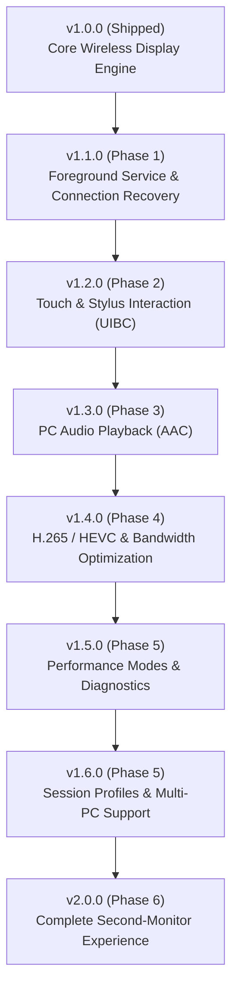

# SecondScreen — Product & Engineering Roadmap

## Vision
Transform an Android tablet (optimized for the OnePlus Pad 2, Snapdragon 8 Gen 3, Android 16 / OxygenOS 16) from a basic Wi-Fi Display receiver into a **complete, ultra-low-latency, interactive secondary monitor for Windows 10/11 PCs** via native `Win + K` wireless display projection.

---

## Release Milestone Overview



---

## Status by Milestone

| Milestone | Target Version | Focus Area | Status |
| :--- | :--- | :--- | :--- |
| **Milestone 0–8** | **v1.0.0** | Core Wireless Display Pipeline & Release | **COMPLETED & RELEASED** ✅ |
| **Milestone 9** | **v1.1.0** | Foreground Service Architecture (`SecondScreenService`) | **IN PROGRESS** 🔄 |
| **Milestone 9.5** | **v1.1.0** | Connection Recovery & Long-Session Stability | **SCHEDULED** 📋 |
| **Milestone 10** | **v1.2.0** | UIBC Touch, Stylus & Input Back Channel | **SCHEDULED** 📋 |
| **Milestone 11** | **v1.3.0** | PC Audio Playback (AAC over MPEG-TS) | **SCHEDULED** 📋 |
| **Milestone 12** | **v1.4.0** | H.265 / HEVC Hardware Video Decoding | **SCHEDULED** 📋 |
| **Milestone 13–14** | **v1.5.0** | Display Controls, Latency Profiles & Real-time HUD | **SCHEDULED** 📋 |
| **Milestone 15–18** | **v1.6.0** | Smart Connection Manager, Multi-PC & Session Profiles | **SCHEDULED** 📋 |
| **Milestone 19–20** | **v2.0.0** | Security Hardening, Broad Device Compatibility & v2.0 Release | **SCHEDULED** 📋 |

---

# Phase Details

## Phase 1 — Production Architecture & Reliability (v1.1.0)

### Milestone 9 — Foreground Service Architecture
Decouple the entire streaming engine from the Android UI lifecycle (`MainActivity`) into a dedicated foreground service (`SecondScreenService`).

```text
MainActivity / Jetpack Compose UI
        │
        │ StateFlow / Binder Commands / Surface
        ▼
SecondScreenService (Foreground Service)
        │
        ├── Connection Manager (LAN MS-MICE & P2P WFD)
        ├── RTSP Protocol Engine (:7236)
        ├── RTP Media Receiver (:19000 UDP)
        ├── MPEG-TS Zero-Copy Demuxer
        └── Hardware Video Decoder (c2.qti.avc.decoder)
```

**Key Deliverables**:
- Service lifecycle independent of UI lifecycle.
- Projection stream survives Activity recreation, screen rotation, and backgrounding.
- Continuous background playback with persistent system notification containing:
  - Connection status, peer name/IP, stream resolution, and live bitrate.
  - Quick action to Disconnect session.
- Seamless re-attachment of `SurfaceView` when returning to foreground.
- Zero socket, coroutine, buffer, or `MediaCodec` memory leaks on lifecycle transitions.

### Milestone 9.5 — Connection Recovery & Long-Session Stability
Harden the connection state machine against network instability, Wi-Fi drops, and temporary signal degradation.

```text
DISCONNECTED ──► DISCOVERING ──► CONNECTING ──► NEGOTIATING ──► STREAMING
      ▲                                                             │
      │                     (Network Dropout / Timeout)              │
      │                                                             ▼
      └─────────────────────────────────────────────────────── INTERRUPTED
                                                                    │
                                                            (Auto-Reconnect)
                                                                    ▼
                                                              RECONNECTING
```

**Key Deliverables**:
- Explicit StateFlow-driven connection states.
- Automatic reconnection logic for dirty Wi-Fi drops and router handoffs.
- Stress testing: 1-hour+ continuous streaming sessions with zero frame drift or memory growth.
- Decoder recovery on corrupted NALs or sudden parameter changes.

---

## Phase 2 — Interactive Second Monitor (v1.2.0)

### Milestone 10 — UIBC Touch & Stylus
Implement the User Input Back Channel (UIBC) per Wi-Fi Display Specification v1.1.0 and `[MS-WFDPE]`.

```text
Tablet Touch / Stylus Input
            │
            ▼
Orientation & Scaling Transformation
(Fit / Fill / Stretch / 7:5 / Display Rotation)
            │
            ▼
Normalized Display Coordinates (0..65535)
            │
            ▼
UIBC Packet Assembly (TCP / RTSP Backchannel)
            │
            ▼
Windows Injected Touch / Pen Input
```

**Key Deliverables**:
- Multi-touch finger input (Touch Down, Move, Up).
- Active stylus support (OnePlus Stylo 2 / USI pen):
  - Sub-pixel coordinate precision.
  - Pressure sensitivity levels.
  - Hover detection and barrel button events.
- Coordinate transformation matrix taking into account:
  - Resolution mode (720p, 1080p, 1200p, 3K).
  - Scaling mode (Letterbox Fit, Fill Crop, Stretch).
  - Windows DPI scaling factor.

---

## Phase 3 — Audio (v1.3.0)

### Milestone 11 — PC Audio Playback
Extend the MPEG-TS demuxer to split video and audio elementary streams simultaneously.

```text
MPEG-TS (RTP PT=33)
        │
        ├── Video Stream (PID 0x1011) ──► VideoDecoder ──► SurfaceView
        │
        └── Audio Stream (PID 0x1100) ──► AudioDecoder ──► AudioTrack (Low Latency)
```

**Key Deliverables**:
- Audio stream detection in MPEG-TS PMT (AAC / LPCM).
- Low-latency `AudioTrack` playback (using `AudioAttributes.USAGE_MEDIA` with low-latency flags).
- Tight A/V synchronization using Presentation Time Stamps (PTS).
- Clean handling of audio sample rate changes (44.1 kHz / 48 kHz).
- Mute/Volume controls directly inside the floating player HUD.

---

## Phase 4 — Codec & Bandwidth Optimization (v1.4.0)

### Milestone 12 — H.265 / HEVC Hardware Video Decoding
Add H.265 / HEVC codec negotiation for high-resolution bandwidth reduction.

**Key Deliverables**:
- Dynamic negotiation: advertise HEVC Constrained Main Profile if supported by Windows.
- Fallback to H.264 when HEVC is rejected or unavailable.
- Lower bitrate footprint for 3K (3000x2120) streaming over Wi-Fi.
- Hardware decoding verification on Snapdragon 8 Gen 3 (`c2.qti.hevc.decoder`).

---

## Phase 5 — Second-Monitor Experience & Intelligence (v1.5.0 – v1.6.0)

### Milestone 13 — Display & Workspace Controls
- In-session floating HUD: FPS counter, bitrate, latency estimate, dropped frames.
- Quick display rotation locking (Landscape / Reverse Landscape / Portrait).
- Brightness adjustment slider inside player view.

### Milestone 14 — Performance & Latency Modes
- **Quality Mode**: Maximum bitrate (up to 50 Mbps), high buffer stability, prioritized visual fidelity.
- **Balanced Mode**: Dynamic bitrate adaptation for everyday desktop multitasking.
- **Ultra-Low Latency Mode**: Minimal queue depth, instant frame drop on late presentation, sub-frame decode.

### Milestone 15 — Smart Connection Manager
- Auto-detection of optimal connection path (Router LAN vs Direct P2P).
- One-tap quick connect based on previously seen Windows hosts.

### Milestone 16 — Network Diagnostics
- Detailed real-time networking and decoder metrics screen.
- One-click diagnostic export for troubleshooting.

### Milestone 17 — Session Profiles & Multi-PC
- Remember host profiles (e.g. "Desktop PC - 3K Quality", "Work Laptop - 1080p Low Latency").
- Auto-apply preferred settings upon host connection.

---

## Phase 6 — Hardening, Compatibility & v2.0 Release (v2.0.0)

### Milestone 19 — Privacy & Security Hardening
- Rigorous bounds checking on all protocol parsers (RTSP, MICE, UIBC, MPEG-TS).
- Strict source IP verification and local network authorization.
- Zero cleartext credential logging.

### Milestone 20 — Compatibility Testing & Production Release
- Multi-device validation (Windows 10, Windows 11, Intel/AMD/Nvidia GPUs).
- Multi-hour continuous endurance testing.
- Final v2.0.0 milestone release.
